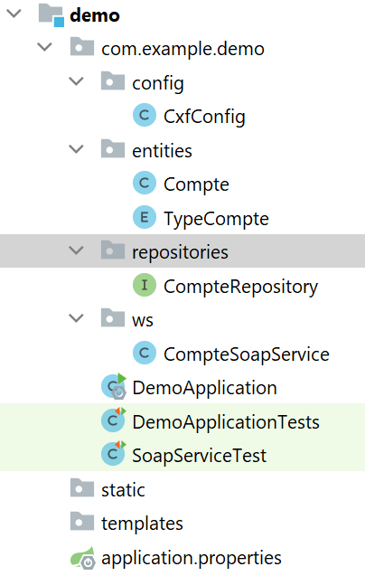
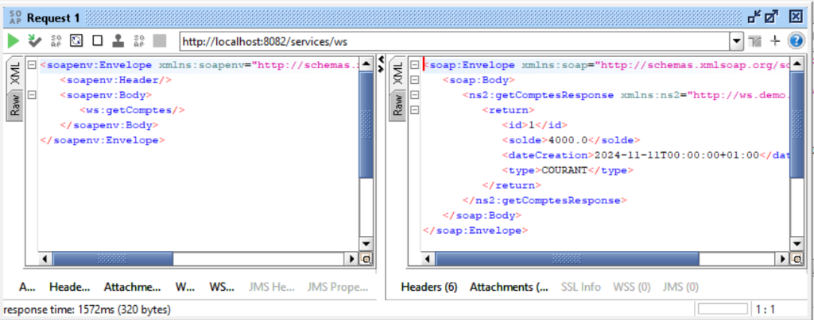
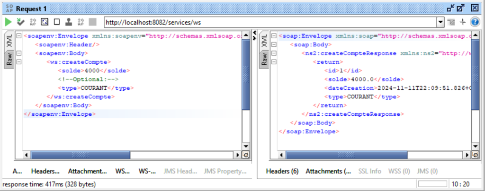

# TP 13 : Web Service SOAP avec JAX-WS et Spring Boot

## 🎯 Objectif

Créer un **Web Service SOAP** avec **JAX-WS** et **Apache CXF** dans **Spring Boot** pour gérer des comptes bancaires.

---

## 📱 Screenshots



### Tests SoapUI

<table>
  <tr>
    <td></td>
    <td></td>
  </tr>
  <tr>
    <td align="center"><b>getComptes()</b></td>
    <td align="center"><b>createCompte()</b></td>
  </tr>
</table>

---

## 📋 Fonctionnalités

- ✅ **Récupérer tous les comptes** : `getComptes()`
- ✅ **Récupérer un compte par ID** : `getCompteById(id)`
- ✅ **Créer un nouveau compte** : `createCompte(solde, type)`
- ✅ **Supprimer un compte** : `deleteCompte(id)`
- ✅ **WSDL généré automatiquement** : http://localhost:8082/services/ws?wsdl

---

## 🛠️ Stack Technologique

| Technologie | Version | Rôle |
|-------------|---------|------|
| **Spring Boot** | 3.x | Framework backend |
| **Apache CXF** | 4.0.2 | Implémentation JAX-WS |
| **JAX-WS** | Jakarta EE | Spécification SOAP |
| **JAXB** | Jakarta EE | Sérialisation XML |
| **Spring Data JPA** | - | Persistence |
| **H2 Database** | - | Base en mémoire |
| **Lombok** | - | Réduction boilerplate |

---

## 📁 Structure du Projet

```
TP13-SOAP-WebService/
├── src/main/
│   ├── java/com/example/demo/
│   │   ├── entities/
│   │   │   ├── Compte.java              # Entité JPA + JAXB
│   │   │   └── TypeCompte.java          # Enum COURANT/EPARGNE
│   │   ├── repositories/
│   │   │   └── CompteRepository.java    # JPA Repository
│   │   ├── ws/
│   │   │   └── CompteSoapService.java   # Service SOAP JAX-WS
│   │   ├── config/
│   │   │   └── CxfConfig.java           # Configuration CXF
│   │   └── DemoApplication.java         # Main Spring Boot
│   └── resources/
│       └── application.properties        # Configuration
├── pom.xml                               # Maven dependencies
└── README.md
```

---

## 🚀 Installation

### 1. Créer le projet Spring Boot

**Via Spring Initializr:**
- Group: `com.example`
- Artifact: `demo`
- Java: 17+
- Dependencies:
  - Spring Web
  - Spring Data JPA
  - H2 Database
  - Lombok

### 2. Ajouter Apache CXF

**pom.xml:**

```xml
<dependencies>
    <!-- Apache CXF Core -->
    <dependency>
        <groupId>org.apache.cxf</groupId>
        <artifactId>cxf-core</artifactId>
        <version>4.0.2</version>
    </dependency>
    
    <!-- Apache CXF Starter JAX-WS -->
    <dependency>
        <groupId>org.apache.cxf</groupId>
        <artifactId>cxf-spring-boot-starter-jaxws</artifactId>
        <version>4.0.2</version>
    </dependency>
</dependencies>
```

### 3. Configuration

**application.properties:**

```properties
# H2 Database
spring.datasource.url=jdbc:h2:mem:testdb
spring.datasource.username=sa
spring.datasource.password=
spring.datasource.driverClassName=org.h2.Driver

# JPA
spring.jpa.hibernate.ddl-auto=update
spring.jpa.show-sql=true

# H2 Console
spring.h2.console.enabled=true
spring.h2.console.path=/h2-console

# Server
server.port=8082

# CXF
cxf.path=/services
```

---

## 💻 Code Source

### 1. Entités

**TypeCompte.java:**

```java
package com.example.demo.entities;

public enum TypeCompte {
    COURANT,
    EPARGNE
}
```

**Compte.java:**

```java
package com.example.demo.entities;

import jakarta.persistence.*;
import jakarta.xml.bind.annotation.XmlAccessType;
import jakarta.xml.bind.annotation.XmlAccessorType;
import jakarta.xml.bind.annotation.XmlRootElement;
import lombok.AllArgsConstructor;
import lombok.Data;
import lombok.NoArgsConstructor;

import java.util.Date;

@Entity
@Data
@NoArgsConstructor
@AllArgsConstructor
@XmlRootElement
@XmlAccessorType(XmlAccessType.FIELD)
public class Compte {
    @Id
    @GeneratedValue(strategy = GenerationType.IDENTITY)
    private Long id;
    
    private double solde;
    
    @Temporal(TemporalType.DATE)
    private Date dateCreation;
    
    @Enumerated(EnumType.STRING)
    private TypeCompte type;
}
```

**Annotations JAXB:**
- `@XmlRootElement` : Classe racine du document XML
- `@XmlAccessorType(FIELD)` : Sérialisation de tous les champs

### 2. Repository

**CompteRepository.java:**

```java
package com.example.demo.repositories;

import com.example.demo.entities.Compte;
import org.springframework.data.jpa.repository.JpaRepository;
import org.springframework.stereotype.Repository;

@Repository
public interface CompteRepository extends JpaRepository<Compte, Long> {
}
```

### 3. Service SOAP

**CompteSoapService.java:**

```java
package com.example.demo.ws;

import com.example.demo.entities.Compte;
import com.example.demo.entities.TypeCompte;
import com.example.demo.repositories.CompteRepository;

import jakarta.jws.WebMethod;
import jakarta.jws.WebParam;
import jakarta.jws.WebService;
import org.springframework.beans.factory.annotation.Autowired;
import org.springframework.stereotype.Component;

import java.util.Date;
import java.util.List;

@Component
@WebService(serviceName = "BanqueWS")
public class CompteSoapService {
    
    @Autowired
    private CompteRepository compteRepository;
    
    @WebMethod
    public List<Compte> getComptes() {
        return compteRepository.findAll();
    }
    
    @WebMethod
    public Compte getCompteById(@WebParam(name = "id") Long id) {
        return compteRepository.findById(id).orElse(null);
    }
    
    @WebMethod
    public Compte createCompte(@WebParam(name = "solde") double solde,
                                @WebParam(name = "type") TypeCompte type) {
        Compte compte = new Compte(null, solde, new Date(), type);
        return compteRepository.save(compte);
    }
    
    @WebMethod
    public boolean deleteCompte(@WebParam(name = "id") Long id) {
        if (compteRepository.existsById(id)) {
            compteRepository.deleteById(id);
            return true;
        }
        return false;
    }
}
```

**Annotations JAX-WS:**
- `@WebService` : Marque la classe comme service SOAP
- `@WebMethod` : Expose la méthode via SOAP
- `@WebParam` : Nomme les paramètres dans le WSDL

### 4. Configuration CXF

**CxfConfig.java:**

```java
package com.example.demo.config;

import com.example.demo.ws.CompteSoapService;
import lombok.AllArgsConstructor;
import org.apache.cxf.Bus;
import org.apache.cxf.jaxws.EndpointImpl;
import org.springframework.context.annotation.Bean;
import org.springframework.context.annotation.Configuration;

@Configuration
@AllArgsConstructor
public class CxfConfig {
    
    private CompteSoapService compteSoapService;
    private Bus bus;
    
    @Bean
    public EndpointImpl endpoint() {
        EndpointImpl endpoint = new EndpointImpl(bus, compteSoapService);
        endpoint.publish("/ws");
        return endpoint;
    }
}
```

**Rôle:**
- Publie le service SOAP sur `/services/ws`
- Configure l'endpoint avec Apache CXF

---

## 🧪 Tests avec SoapUI

### 1. Récupérer le WSDL

```
http://localhost:8082/services/ws?wsdl
```

### 2. Créer un projet SoapUI

1. Ouvrir SoapUI
2. **File** → **New SOAP Project**
3. Project Name: `TestBanqueSOAP`
4. Initial WSDL: `http://localhost:8082/services/ws?wsdl`
5. **OK**

### 3. Tester les opérations

**getComptes:**
```xml
<soapenv:Envelope xmlns:soapenv="http://schemas.xmlsoap.org/soap/envelope/" xmlns:ws="http://ws.demo.example.com/">
   <soapenv:Header/>
   <soapenv:Body>
      <ws:getComptes/>
   </soapenv:Body>
</soapenv:Envelope>
```

**createCompte:**
```xml
<soapenv:Envelope xmlns:soapenv="http://schemas.xmlsoap.org/soap/envelope/" xmlns:ws="http://ws.demo.example.com/">
   <soapenv:Header/>
   <soapenv:Body>
      <ws:createCompte>
         <solde>4000.0</solde>
         <type>COURANT</type>
      </ws:createCompte>
   </soapenv:Body>
</soapenv:Envelope>
```

**getCompteById:**
```xml
<soapenv:Envelope xmlns:soapenv="http://schemas.xmlsoap.org/soap/envelope/" xmlns:ws="http://ws.demo.example.com/">
   <soapenv:Header/>
   <soapenv:Body>
      <ws:getCompteById>
         <id>1</id>
      </ws:getCompteById>
   </soapenv:Body>
</soapenv:Envelope>
```

**deleteCompte:**
```xml
<soapenv:Envelope xmlns:soapenv="http://schemas.xmlsoap.org/soap/envelope/" xmlns:ws="http://ws.demo.example.com/">
   <soapenv:Header/>
   <soapenv:Body>
      <ws:deleteCompte>
         <id>1</id>
      </ws:deleteCompte>
   </soapenv:Body>
</soapenv:Envelope>
```

---

## 🔧 Fonctionnement SOAP

### Architecture

```
Client SOAP
    ↓
WSDL (Description du service)
    ↓
Apache CXF (Framework JAX-WS)
    ↓
CompteSoapService (@WebService)
    ↓
CompteRepository (JPA)
    ↓
H2 Database
```

### Flux d'une requête SOAP

1. **Client** envoie requête SOAP XML
2. **CXF** désérialise XML → objets Java (JAXB)
3. **Service** traite la requête
4. **Repository** accède à la base de données
5. **CXF** sérialise résultat → XML SOAP
6. **Client** reçoit réponse SOAP

---

## 📊 Annotations Clés

### JAX-WS (Web Service)
- `@WebService` : Déclare un service SOAP
- `@WebMethod` : Expose une méthode
- `@WebParam` : Nomme un paramètre

### JAXB (Sérialisation XML)
- `@XmlRootElement` : Élément racine XML
- `@XmlAccessorType` : Type d'accès (FIELD, PROPERTY)
- `@XmlElement` : Personnalise un élément

### Spring
- `@Component` : Bean Spring
- `@Autowired` : Injection de dépendance
- `@Configuration` : Classe de configuration

---

## 🏃 Exécution

```bash
# Compiler
mvn clean install

# Lancer
mvn spring-boot:run

# Accès
WSDL: http://localhost:8082/services/ws?wsdl
H2 Console: http://localhost:8082/h2-console
```

---

## 📚 Ressources

- [Apache CXF Documentation](https://cxf.apache.org/)
- [JAX-WS Tutorial](https://jakarta.ee/specifications/xml-web-services/)
- [SoapUI](https://www.soapui.org/)

---

## 👨‍💻 Auteur

**Imad ADAOUMOUM**

## 📄 License

Ce projet est réalisé dans un cadre académique.
